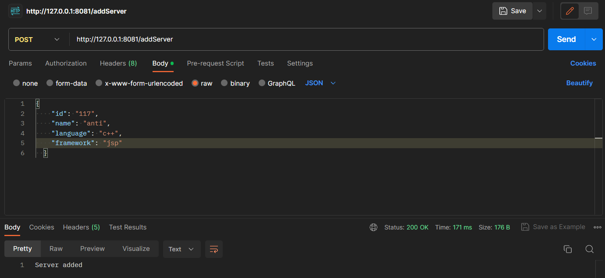
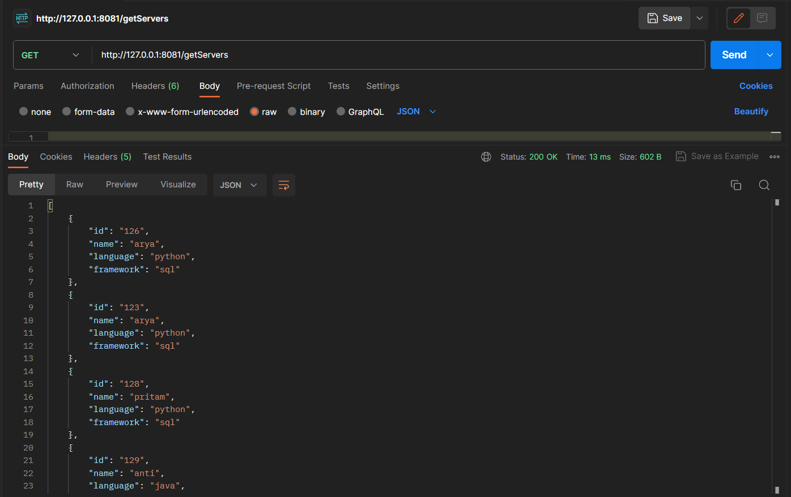
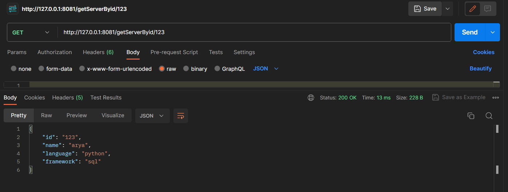
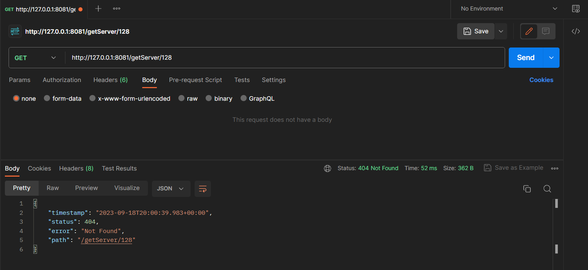
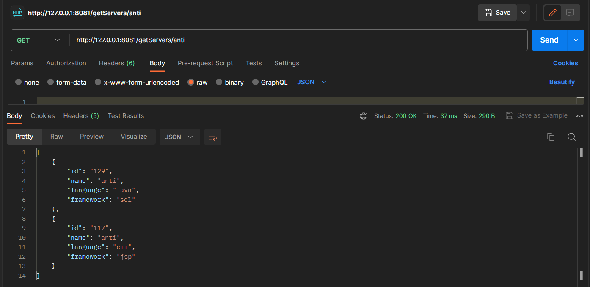
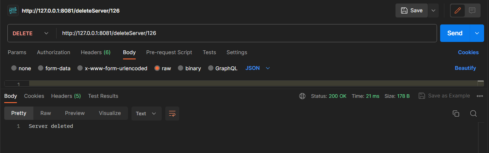

<h3>An application in java which provides a REST API with endpoints for searching, creating and deleting “server” objects</h3>

<h4>Server Model Body</h4>

```json
{
  "name": "my centos",
  "id": "123",
  "language": "java",
  "framework": "django"
}
```

## Requirements
* JDK 20 (java)
* Mongodb
* Spring Boot support in Visual Studio Code
* Postman for testing the API


## How to Run the Project
To run this project, follow these steps:
1. Clone the project: <code> git clone https://github.com/pipspritam/JavaRESTAPI.git </code>
2. Create a database in MongoDB using MongoDB Compass with the following details:
- Database Name: `servers`
- Collection Name: `servers`
3. Start the Project.
4. Test the APIs using Postman.


## End points of API
1. Create a new server <br>
   http://127.0.0.1:8081/addServer
   
   
3. Get a list of all servers <br>
   http://127.0.0.1:8081/getServers
   
   
4. Get a single server by ID <br>
   http://127.0.0.1:8081/getServerByid/{id}
   * If given ID is present in database
   
   * If given ID is not present in database
   
   
6. Find servers by name <br>
   http://127.0.0.1:8081/getServers/{name}

   
   
7. Delete a server <br>
   http://127.0.0.1:8081/deleteServer/{id} 

     


